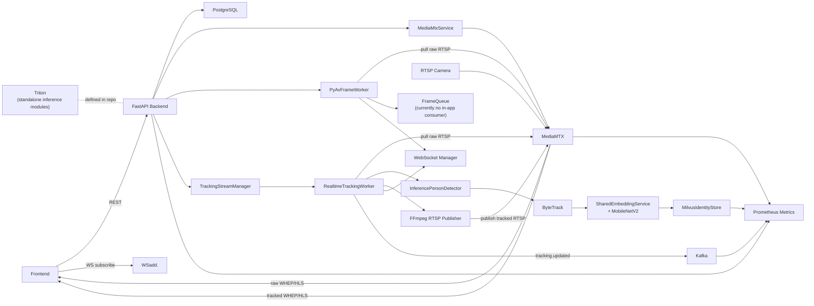
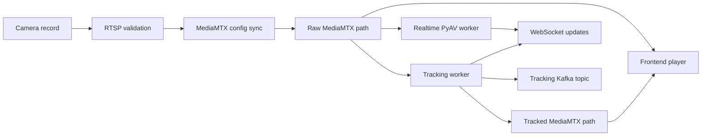
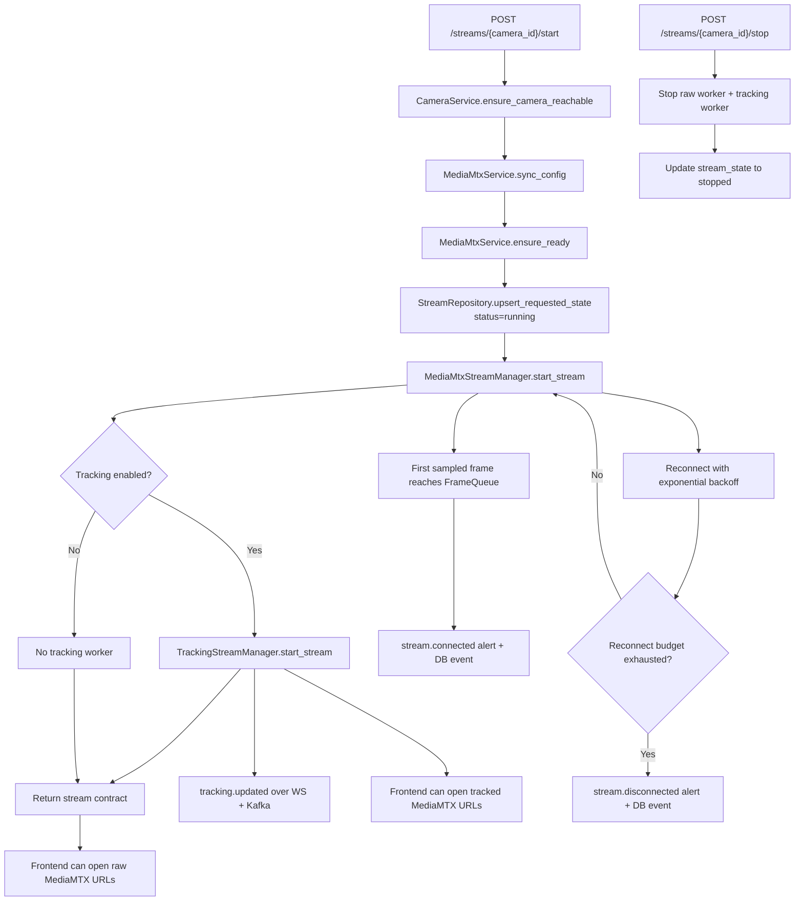
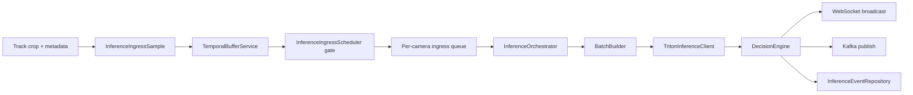

# RTSP Camera Backend

This document describes the backend as it exists in the repository today. It is based on the code under `backend/src` and related runtime assets, and it distinguishes between:

- the active runtime path created by `src/main.py`
- standalone or legacy modules that are present in the repo but are not currently started by the FastAPI lifespan

## System Overview

The backend is the control and processing plane for an RTSP camera platform. Its current responsibilities are:

- storing camera inventory and stream state in PostgreSQL
- validating camera RTSP connectivity before stream start
- generating and synchronizing MediaMTX path configuration
- exposing raw playback contracts for WebRTC, HLS, and internal RTSP pull
- starting background workers for realtime stream liveness sampling
- starting background workers for person detection, tracking, re-identification, and annotated stream publishing
- broadcasting stream and tracking updates over WebSocket
- publishing tracking metadata to Kafka
- exposing health and Prometheus metrics for observability

The backend does not serve video directly to browsers. Media flows through MediaMTX:

- raw camera video is published by MediaMTX from configured camera sources
- tracked video is republished by the tracking worker back into a second MediaMTX path
- the frontend consumes MediaMTX playback URLs, not direct camera RTSP URLs

## Current Runtime Scope

### Actively wired by `src/main.py`

- FastAPI application startup and shutdown
- PostgreSQL connection pooling and migrations
- camera CRUD and RTSP validation
- MediaMTX config rendering, readiness checks, and optional process management
- realtime PyAV frame workers managed by `src/services/realtime_video`
- tracking workers managed by `src/services/tracking`
- WebSocket broadcast management
- Kafka consumer for stream and AI result topics
- Kafka producer for tracking updates
- Prometheus metrics and health endpoints

### Present in the repository but not started by the current lifespan

- `src/services/inference/*`
  - standalone inference building blocks for temporal buffering, Triton dispatch, decisioning, and alert persistence
- `src/services/stream/camera_worker.py` and `src/services/stream/stream_manager.py`
  - an older FFmpeg/HLS worker path that is not used by the current bootstrap
- `backend/main.py` and `backend/ipynb/*`
  - older or experimental code paths not imported by `src/main.py`

## Architecture

The backend is easiest to understand as five cooperating planes:

- control plane
  - FastAPI routes, settings, exception handling, PostgreSQL state, and response contracts
- media plane
  - MediaMTX path generation, raw playback endpoints, tracked playback endpoints
- realtime worker plane
  - PyAV frame workers that connect to MediaMTX, sample frames, and surface liveness/metrics
- tracking plane
  - person detection, ByteTrack tracking, appearance embedding, Milvus identity lookup, annotated RTSP republishing
- observability plane
  - Prometheus metrics, runtime/system collectors, Grafana/Loki/Alloy support stack

The repository also contains a standalone inference plane under `src/services/inference`, but that plane is not currently attached to the active runtime bootstrap.

### Overall Design



### Subsystem Interactions

- camera routes call `CameraService`, which persists camera data and asks `MediaMtxService` to regenerate runtime path configuration
- stream routes call `StreamService`, which coordinates camera validation, MediaMTX readiness, realtime workers, tracking workers, and contract generation
- realtime stream workers send connection alerts through `WebSocketStreamConnectionAlertPublisher`, which updates `stream_state` and broadcasts stream contract updates
- tracking workers broadcast metadata directly through WebSocket and publish tracking snapshots to Kafka
- the Kafka consumer listens for stream lifecycle topics and AI result topics, then rebroadcasts them over WebSocket
- observability collectors poll the running managers instead of instrumenting the hot path directly

## High-Level Flow

The active backend flow from camera registration to tracked playback is:

1. A camera is created in PostgreSQL through the camera API.
2. `MediaMtxService` renders raw and tracked paths for every known camera.
3. `POST /streams/{camera_id}/start` validates the camera RTSP source and ensures the MediaMTX path is ready.
4. The backend returns a stream contract with MediaMTX playback URLs.
5. A realtime PyAV worker connects to the raw MediaMTX RTSP path and samples frames for liveness and metrics.
6. If tracking is enabled, a tracking worker independently pulls the same raw MediaMTX RTSP path, detects and tracks people, resolves persistent identities, and republishes an annotated stream to a tracked MediaMTX path.
7. The frontend can consume either the raw MediaMTX stream or the tracked MediaMTX stream, while WebSocket and Kafka carry metadata and lifecycle updates.



## Active Stream Lifecycle

This is the lifecycle actually executed by `StreamService`, `MediaMtxService`, `MediaMtxStreamManager`, and `TrackingStreamManager`.

### Step-by-step

1. `POST /streams/{camera_id}/start` reaches `StreamService.start_stream()`.
2. `CameraService.ensure_camera_reachable()` validates the source RTSP URL through `ffprobe` or a PyAV fallback.
3. `MediaMtxService.sync_config()` regenerates config from the full camera inventory.
4. `MediaMtxService.ensure_ready()` confirms MediaMTX is reachable and the requested path exists or can be started.
5. `StreamRepository.upsert_requested_state()` persists the requested stream state and MediaMTX URLs.
6. `MediaMtxStreamManager.start_stream()` starts a realtime PyAV worker for the raw stream.
7. If tracking is enabled, `TrackingStreamManager.start_stream()` starts a tracking worker for the tracked stream path.
8. A stream contract is returned immediately to the caller.
9. When the first sampled frame is successfully queued, the realtime worker emits a one-time `stream.connected` alert through WebSocket and updates `stream_state`.
10. While the stream is alive, REST status endpoints and WebSocket snapshots are built from the database record plus live worker snapshots.
11. `POST /streams/{camera_id}/stop` stops the realtime and tracking workers and persists `stream_state=stopped`.
12. If the realtime worker exhausts its reconnect budget, a terminal `stream.disconnected` alert is broadcast and persisted.

### Lifecycle Diagram



## Core Modules Breakdown

### `src/main.py`

Application bootstrap is centralized here. The lifespan function creates the database, services, metrics infrastructure, WebSocket manager, Kafka consumer, and tracking runtime services, then stores them in `application.state.container`.

### `src/core`

- `config.py`
  - loads environment-driven settings with Pydantic
- `db.py`
  - owns the asyncpg pool and SQL file execution helpers
- `exceptions/*`
  - maps domain exceptions to API-friendly error payloads
- `logger/logger.py`
  - sets structured or plain logging for the whole app

### `src/routes`

- `camera_routes.py`
  - camera CRUD and validation endpoints
- `stream_routes.py`
  - stream start/stop/status/info plus the stream WebSocket endpoint
- `health_routes.py`
  - platform, database, and per-stream health views

### `src/services/camera`

- `CameraRepository`
  - SQL-backed persistence for the `cameras` table
- `CameraService`
  - camera CRUD, response shaping, validation persistence, MediaMTX config refresh on camera changes
- `CameraValidator`
  - RTSP reachability checks through `ffprobe`, with a PyAV fallback path

### `src/services/presentation`

- `StreamContractService`
  - combines database state, realtime worker state, tracking state, and MediaMTX URLs into the frontend contract
- `WebSocketManager`
  - tracks subscribers and broadcasts stream/tracking/inference envelopes

### `src/services/realtime_video`

This is the active raw-stream worker stack.

- `MediaMtxService`
  - renders MediaMTX config, optionally starts MediaMTX, or syncs paths through the Control API
- `mediamtx.py`
  - endpoint and path-name helpers
- `mediamtx_control_api.py`
  - runtime path CRUD against MediaMTX
- `MediaMtxStreamManager`
  - owns one in-process PyAV worker task per camera
- `PyAvFrameWorker`
  - pulls raw RTSP from MediaMTX, samples frames, updates metrics, and emits connection alerts
- `FrameQueue`
  - bounded async queue for sampled frames
- `alert_publisher.py`
  - rebuilds and broadcasts stream contracts on connect/disconnect

### `src/services/tracking`

This is the active person-tracking stack.

- `TrackingStreamManager`
  - owns tracking workers and exposes tracked stream endpoints and snapshots
- `RealtimeTrackingWorker`
  - decodes frames, detects people, enriches identities, draws annotations, and republishes video
- `detectors/inference_detector.py`
  - Roboflow Inference SDK person detector
- `trackers/bytetrack.py`
  - ByteTrack adapter for person tracks
- `reid/embedder.py`
  - MobileNetV2 bottleneck embedder used for appearance vectors
- `reid/shared_embedding_service.py`
  - shared embedding batching service across workers
- `identity/milvus_store.py`
  - persistent identity resolution and refresh in Milvus
- `updates.py`
  - WebSocket and Kafka fanout for tracking metadata

### `src/services/tracking_kafka`

- `TrackingKafkaProducerService`
  - lifecycle wrapper around `AIOKafkaProducer`
- `KafkaTrackingUpdatePublisher`
  - publishes tracking snapshots keyed by `camera_id`

### `src/services/inference`

This package defines a separate inference plane:

- `TemporalBufferService`
  - rolling per-identity clip buffer
- `InferenceIngressScheduler`
  - gating and enqueueing of ready temporal batches
- `BatchBuilder`
  - tensor assembly for Triton
- `TritonInferenceClient`
  - bounded async Triton gRPC client
- `DecisionEngine`
  - thresholding from raw score to `normal` / `warning` / `alert`
- `InferenceOrchestrator`
  - consumes queued batches, runs Triton inference, broadcasts alerts, and persists non-normal events
- `InferenceEventRepository`
  - database writer for alert events

These modules are not instantiated by the current application bootstrap.

### `src/observability`

- `metrics.py`
  - Prometheus metric definitions
- `metrics_server.py`
  - embedded `/metrics` HTTP server
- `http_middleware.py`
  - request count and latency instrumentation
- `system_metrics.py`
  - psutil-based host/process metrics
- `runtime_metrics.py`
  - pulls runtime snapshots from the managers

## Active Tracking Pipeline

The active end-to-end tracking flow is:

1. `TrackingStreamManager.start_stream()` builds raw and tracked MediaMTX endpoints for a camera.
2. `RealtimeTrackingWorker` opens the raw MediaMTX RTSP path with PyAV.
3. Frames are sampled at `tracking_sample_fps`.
4. `InferencePersonDetector` runs person detection on each sampled frame.
5. `RoboflowByteTrackPersonTracker` updates local track IDs and track state.
6. Each visible track is clamped to frame bounds and optionally cropped.
7. Crops that need identity refresh are pushed into a per-worker enrichment queue.
8. The enrichment thread submits crops to `SharedEmbeddingService`, which batches embedding requests across workers.
9. `MilvusIdentityStore` resolves or refreshes persistent identities from the resulting embeddings.
10. The tracking worker overlays boxes and labels onto the frame.
11. A bounded FFmpeg publisher thread republishes annotated frames to the tracked MediaMTX RTSP path.
12. Tracking metadata is broadcast over WebSocket and published to Kafka.

### Detection, Tracking, and Identity Roles

- detection answers: "where are the people in this frame?"
- ByteTrack answers: "which current detection belongs to which track?"
- re-identification answers: "does this local track match a persistent identity already known to the system?"
- MediaMTX republishing answers: "where can the tracked video be played back?"

### Identity States

Tracking metadata carries `persistent_id_state`:

- `pending`
  - a crop has been queued but identity resolution is not finished yet
- `assigned`
  - the identity matched an existing Milvus record
- `local`
  - embedding or Milvus lookup failed, or a new unmatched local identity is being used

## Inference Pipeline

> The inference pipeline below describes the code under `src/services/inference`. These modules are present in the repository, but the current FastAPI startup path does not instantiate or feed them.

### Implemented Flow in `src/services/inference`



### End-to-end behavior

1. A caller creates `InferenceIngressSample` objects that include:
   - camera and stream identity
   - local and persistent track IDs
   - bounding box metadata
   - the crop image itself
   - track age and stability metadata
2. `TemporalBufferService` stores samples in a rolling buffer keyed by `persistent_id`.
3. The buffer keeps the most recent `temporal_buffer_size` samples per identity.
4. The buffer is reset for an identity when:
   - the gap since the last sample exceeds `identity_gap_reset_seconds`
   - a sample arrives with `persistent_id_state == "pending"`
5. `InferenceIngressScheduler.ingest()` evaluates a dispatch gate.
6. When the gate passes, the scheduler enqueues the full buffered sequence for that identity.
7. `InferenceOrchestrator` consumes queued batches asynchronously.
8. `BatchBuilder` resizes crops to `224x224` and builds Triton tensors:
   - `cnn_transformer`: `(1, C, T, H, W)`
   - `vjepa_probe`: `(1, T, C, H, W)`
9. `TritonInferenceClient` sends the batch to a Triton model whose name matches the selected strategy.
10. `DecisionEngine` maps the returned scalar score into `normal`, `warning`, or `alert`.
11. The orchestrator:
   - broadcasts `inference.updated`
   - broadcasts an additional `inference.alert` for non-normal results
   - optionally publishes to Kafka
   - persists non-normal events

### Dispatch trigger conditions

All of the following must be true before a batch is queued:

- `persistent_id_state == "assigned"`
- buffered sequence depth is at least `temporal_buffer_size`
- `consecutive_hits >= dispatch_min_consecutive_hits`
- `frames_since_update == 0`
- `width >= dispatch_min_crop_width`
- `height >= dispatch_min_crop_height`

### Important current-state notes

- the current bootstrap does not create an inference manager or orchestrator
- `StreamStartRequest.enable_inference` exists in the request schema but is not consumed by `StreamService.start_stream()`
- `StreamInfoResponse` has an `inference` field, but `StreamContractService` does not populate it today
- `PATCH /streams/{camera_id}/inference` is declared, but the current container does not provide `inference_manager`

## Concurrency and Execution Model

### Async control plane

- FastAPI request handling, lifespan management, WebSocket fanout, Kafka consumer work, and runtime collectors run on the main asyncio event loop
- PostgreSQL access uses an asyncpg connection pool
- Kafka integration uses `aiokafka`

### Threaded and blocking work

- camera validation runs `ffprobe` through `asyncio.to_thread()` and falls back to a blocking PyAV check in a thread
- MediaMTX Control API calls use blocking `urllib` wrapped in `asyncio.to_thread()`
- each realtime PyAV worker runs as one asyncio task that repeatedly offloads a blocking decode session to a thread
- each tracking worker runs as one asyncio task that repeatedly offloads a blocking tracking session to a thread

### Per-camera runtime structure

For each active raw stream:

- 1 asyncio task for worker lifecycle
- 1 blocking PyAV decode thread inside `asyncio.to_thread()`

For each active tracking stream:

- 1 asyncio task for worker lifecycle
- 1 blocking tracking/decode thread inside `asyncio.to_thread()`
- 1 daemon enrichment thread for embedding and identity resolution
- 1 daemon publisher thread feeding FFmpeg stdin
- 1 FFmpeg subprocess publishing annotated RTSP

### Shared execution components

- `SharedEmbeddingService` is a single shared batching service across tracking workers
- `MilvusIdentityStore` uses an internal thread lock around the client and an async semaphore for batch operations
- `DetectorPool` limits how many tracking workers can hold detector instances concurrently

### Queues and backpressure

- `FrameQueue`
  - shared async queue for raw sampled frames
  - default `drop_oldest`
  - default max size comes from `realtime_frame_queue_size`
- tracking enrichment queue
  - per-worker `queue.Queue`
  - max size `64`
  - new crops are skipped when full
- annotated frame queue
  - per-worker publisher queue
  - max size `4`
  - annotated frames are dropped when the publisher falls behind
- inference ingress queue
  - per-camera async queue
  - size controlled by `InferenceWorkerConfig.ingress_queue_maxsize`
  - ready batches are dropped when full

## Configuration and Environment

Runtime settings live in `src/core/config.py` and are loaded from `.env`.

### Core service

- `APP_NAME`
- `APP_VERSION`
- `ENVIRONMENT`
- `DEBUG`
- `PUBLIC_API_BASE_URL`
- `PUBLIC_WS_BASE_URL`
- `CORS_ORIGINS`
- `LOG_LEVEL`
- `JSON_LOGS`
- `FILE_LOGS_ENABLED`
- `LOG_DIRECTORY`
- `LOG_FILE_PREFIX`
- `LOG_FILE_MAX_BYTES`
- `LOG_FILE_BACKUP_COUNT`

By default, backend processes write rotating log files under `backend/runtime/logs/<process-name>/`.

### Database

- `DATABASE_URL`
- `DB_POOL_MIN_SIZE`
- `DB_POOL_MAX_SIZE`
- `RUN_MIGRATIONS_ON_STARTUP`

### Kafka

- `KAFKA_ENABLED`
- `KAFKA_BOOTSTRAP_SERVERS`
- `KAFKA_GROUP_ID`
- `KAFKA_CLIENT_ID`
- `KAFKA_TOPIC_CAMERA_STATUS`
- `KAFKA_TOPIC_CAMERA_EVENTS`
- `KAFKA_TOPIC_CAMERA_AI_RESULTS`
- `KAFKA_TOPIC_CAMERA_TRACKING_UPDATES`

### MediaMTX and transport

- `FFMPEG_BINARY`
- `FFPROBE_BINARY`
- `FFMPEG_RTSP_TRANSPORT`
- `MEDIAMTX_BINARY`
- `MEDIAMTX_MANAGE_PROCESS`
- `MEDIAMTX_GENERATED_CONFIG_PATH`
- `MEDIAMTX_START_TIMEOUT_SECONDS`
- `MEDIAMTX_API_BASE_URL`
- `MEDIAMTX_API_TIMEOUT_SECONDS`
- `MEDIAMTX_API_READY_TIMEOUT_SECONDS`
- `MEDIAMTX_API_USERNAME`
- `MEDIAMTX_API_PASSWORD`
- `MEDIAMTX_API_PASSWORD_FILE`
- `MEDIAMTX_RTSP_BASE_URL`
- `MEDIAMTX_HLS_BASE_URL`
- `MEDIAMTX_WEBRTC_BASE_URL`

### Realtime raw-stream workers

- `REALTIME_FRAME_SAMPLE_FPS`
- `REALTIME_FRAME_QUEUE_SIZE`
- `REALTIME_MAX_RECONNECT_ATTEMPTS`
- `STREAM_START_TIMEOUT_SECONDS`

### Tracking

- `TRACKING_ENABLED_BY_DEFAULT`
- `TRACKING_SAMPLE_FPS`
- `TRACKING_OUTPUT_FPS`
- `TRACKING_DETECTOR_MODEL_ID`
- `TRACKING_DETECTOR_CONFIDENCE_THRESHOLD`
- `TRACKING_DETECTOR_IOU_THRESHOLD`
- `TRACKING_DETECTOR_TARGET_CLASS_NAME`
- `TRACKING_DETECTOR_API_KEY`
- `TRACKING_EMBEDDER_NAME`
- `TRACKING_EMBEDDER_WEIGHTS_PATH`
- `TRACKING_TRACKER_LOST_TRACK_BUFFER`
- `TRACKING_TRACKER_ACTIVATION_THRESHOLD`
- `TRACKING_TRACKER_MINIMUM_CONSECUTIVE_FRAMES`
- `TRACKING_TRACKER_MINIMUM_IOU_THRESHOLD`
- `TRACKING_TRACKER_HIGH_CONF_DET_THRESHOLD`
- `TRACKING_IDENTITY_STORE_URI`
- `TRACKING_IDENTITY_STORE_TOKEN`
- `TRACKING_IDENTITY_COLLECTION_NAME`
- `TRACKING_IDENTITY_DIMENSION`
- `TRACKING_IDENTITY_STORE_TIMEOUT_SECONDS`
- `TRACKING_IDENTITY_SIMILARITY_THRESHOLD`
- `TRACKING_IDENTITY_SEARCH_LIMIT`
- `TRACKING_IDENTITY_SYNC_INTERVAL_SECONDS`
- `TRACKING_PUBLISH_UPDATE_INTERVAL_SECONDS`
- `TRACKING_STREAM_SUFFIX`

### Observability

- `METRICS_ENABLED`
- `METRICS_HOST`
- `METRICS_PORT`
- `METRICS_COLLECTION_INTERVAL_SECONDS`

### Inference note

The standalone inference modules use `InferenceWorkerConfig`, not `Settings`, so the current backend does not expose first-class environment variables for inference strategy, Triton URL, or temporal buffering through `src/core/config.py`.

## Dependencies

### Python libraries

- `fastapi`, `uvicorn`
  - HTTP API and ASGI serving
- `pydantic`, `pydantic-settings`
  - typed configuration and API schemas
- `asyncpg`
  - PostgreSQL connection pool
- `aiokafka`
  - Kafka consumer and producer clients
- `av`
  - PyAV decoding for realtime and tracking workers
- `opencv-python`
  - frame manipulation, drawing, and crop resizing
- `inference`
  - Roboflow Inference SDK for person detection
- `trackers`, `supervision`
  - ByteTrack integration and detection container utilities
- `torch`, `torchvision`
  - appearance embedding model
- `pymilvus`
  - persistent identity storage and similarity search
- `prometheus-client`, `psutil`
  - metrics exposure and system/process sampling

### External binaries

- `ffprobe`
  - camera validation
- `ffmpeg`
  - tracked RTSP republishing
- `mediamtx`
  - stream routing and playback endpoints when process-managed by the backend

### External services

- PostgreSQL
  - required, not started by `docker-compose.yaml`
- MediaMTX
  - raw/tracked stream broker and playback server
- Kafka
  - event transport
- Milvus
  - persistent identity store
- MinIO and etcd
  - Milvus dependencies in the compose stack
- Triton
  - referenced by the standalone inference plane
- Prometheus, Grafana, Loki, Alloy, exporters
  - observability stack

## Storage and Data Model

### Tables created by migrations

- `schema_migrations`
  - migration bookkeeping
- `cameras`
  - camera inventory, source definition, status, validation metadata
- `stream_state`
  - one stream record per camera, including desired state, protocol, worker state, and playback metadata
- `inference_events`
  - inference alert/event storage table defined by the current migration set

### Stream state values

`StreamStatus` values:

- `stopped`
- `starting`
- `running`
- `stopping`
- `reconnecting`
- `error`
- `crashed`

### Camera source modes

A camera can be defined by:

- `direct_rtsp_url`
- `host` + `path` (+ optional credentials and port)

### MediaMTX naming

For a camera:

- raw stream name
  - `metadata.mediamtx_stream_name` if present, otherwise the normalized camera ID
- tracked stream name
  - raw stream name plus `tracking_stream_suffix` (default `tracked`)

## API Surface

### Cameras

- `POST /cameras`
- `GET /cameras`
- `GET /cameras/{camera_id}`
- `PUT /cameras/{camera_id}`
- `DELETE /cameras/{camera_id}`
- `POST /cameras/{camera_id}/validate`

### Streams

- `POST /streams/{camera_id}/start`
- `POST /streams/{camera_id}/stop`
- `GET /streams/{camera_id}/status`
- `GET /streams/{camera_id}/info`
- `PATCH /streams/{camera_id}/inference`
  - declared in the route layer, but not currently wired by the application container
- `WS /streams/ws/updates`
  - optional `?camera_id=<camera_id>` filter

### Health

- `GET /health`
- `GET /health/db`
- `GET /health/stream/{camera_id}`

### WebSocket event types present in the current code

- `stream.snapshot`
  - sent when a client first connects to `/streams/ws/updates`
- `stream.connected`
  - sent by the active realtime PyAV worker path after the first sampled frame is queued
- `stream.disconnected`
  - sent by the active realtime PyAV worker path after reconnect exhaustion
- `tracking.updated`
  - sent by the active tracking worker path
- `stream.updated`
  - sent when stream lifecycle events are consumed from Kafka

The Kafka consumer can also rebroadcast `inference.updated` and `inference.alert` if matching AI result events arrive on `camera.ai_results`.

## Execution Flow

### Startup

1. Load settings and configure logging.
2. Connect to PostgreSQL.
3. Apply pending SQL migrations if enabled.
4. Create repositories, validators, MediaMTX service, frame queue, and metrics recorder.
5. Start the Prometheus metrics server and system metrics collector when metrics are enabled.
6. Build `CameraService` and fetch all current camera records.
7. Generate and sync MediaMTX config from the current camera inventory.
8. Create the WebSocket manager and stream contract service.
9. Create the realtime stream manager and attach the connection alert publisher.
10. Bootstrap tracking services, including:
    - tracking Kafka producer
    - Milvus identity store
    - detector pool
    - shared embedding service
    - tracking manager
11. Create `StreamService`.
12. Start the Kafka consumer.
13. Start runtime metrics collection when metrics are enabled.
14. Store all services in `application.state.container`.

### Runtime

- camera CRUD updates PostgreSQL and attempts to refresh MediaMTX config
- stream start validates the source, ensures MediaMTX readiness, persists desired state, and starts raw/tracking workers
- stream stop tears down raw/tracking workers and persists stopped state
- realtime workers update liveness and queue metrics
- tracking workers publish metadata and tracked video
- WebSocket subscribers receive snapshots and updates

### Shutdown

1. Stop the Kafka consumer.
2. Stop the tracking Kafka producer.
3. Close the tracking manager and its workers.
4. Stop all realtime PyAV workers.
5. Stop runtime and system metrics collectors.
6. Stop the Prometheus metrics server.
7. Stop MediaMTX if the backend is managing its process.
8. Disconnect from PostgreSQL.

## Local Infrastructure

`docker-compose.yaml` starts the backend support stack:

- `mediamtx`
- `etcd`
- `minio`
- `milvus`
- `triton`
- `kafka`
- `kafka-init`
- `node-exporter`
- `postgres-exporter`
- `loki`
- `alloy`
- `prometheus`
- `grafana`

It does not start:

- PostgreSQL
- the FastAPI application itself

Typical local run flow:

```bash
cd backend
docker compose up -d
uvicorn src.main:app --reload
```

## Limitations and Observations

These observations are based on the current code, not on intended future behavior.

1. The dedicated inference plane is not currently integrated into the application bootstrap.
   - `src/main.py` does not create an inference manager.
   - `StreamStartRequest.enable_inference` is not consumed by `StreamService.start_stream()`.
   - `StreamContractService` never populates `StreamInfoResponse.inference`.

2. `PATCH /streams/{camera_id}/inference` is declared but not operational in the current startup path.
   - The route expects `request.app.state.container.inference_manager`, but `ApplicationContainer` does not expose that dependency.

3. The shared `FrameQueue` currently has no runtime consumer inside `src`.
   - `PyAvFrameWorker` publishes sampled frames into it.
   - metrics collect queue depth.
   - no active service in `src/main.py` consumes those frames for downstream processing.

4. The active stream worker path does not publish stream lifecycle events to Kafka.
   - `StreamEventConsumer` listens to `camera.status` and `camera.events`.
   - the active `PyAvFrameWorker` path emits connection alerts directly through WebSocket/database helpers instead of Kafka.
   - Kafka publishing for stream lifecycle exists in the older `src/services/stream/camera_worker.py` path.

5. Tracking concurrency is currently constrained by detector pool sizing.
   - `create_tracking_runtime_services()` creates `DetectorPool` with a single `InferencePersonDetector` instance.
   - `TrackingStreamManager` checks out one detector for the full lifetime of each tracking worker.
   - this makes detector checkout a direct bottleneck for multi-camera tracking concurrency.

6. The standalone inference dispatch gate only allows `persistent_id_state == "assigned"`.
   - the tracking worker marks unmatched or fallback identities as `local`.
   - if the inference plane were wired as-is, only identities matched to an existing Milvus identity would satisfy the current dispatch condition.

7. The current inference persistence code and the migration-defined schema are not aligned.
   - `src/services/inference/event_repository.py` expects columns such as `stream_name`, `local_track_id`, `strategy`, `score`, `alert_level`, `sampled_at`, and `emitted_at`.
   - `004_create_inference_events_table.sql` creates a different shape centered on bounding boxes and `confidence`.

8. The standalone Triton client depends on a package that is not declared in the current Python dependency manifests.
   - `src/services/inference/triton_client.py` imports `tritonclient.grpc.aio`.
   - `pyproject.toml` and `requirements.txt` do not list a Triton Python client package.

9. `src/services/inference/orchestrator.py` imports a symbol that is not defined in `src/services/tracking_kafka/publisher.py`.
   - the orchestrator imports `TrackingKafkaPublisher`.
   - the publisher module currently defines `KafkaTrackingUpdatePublisher`.

10. The repository contains multiple backend generations.
    - the active runtime is the FastAPI/MediaMTX/PyAV stack under `src/`.
    - an older monolithic script still exists at `backend/main.py`.
    - notebooks and prototype code exist under `backend/ipynb/`.

11. Camera CRUD treats MediaMTX sync failures as warnings.
    - `CameraService._sync_mediamtx_config()` logs failures and returns.
    - the stricter MediaMTX readiness check happens later during stream start.
