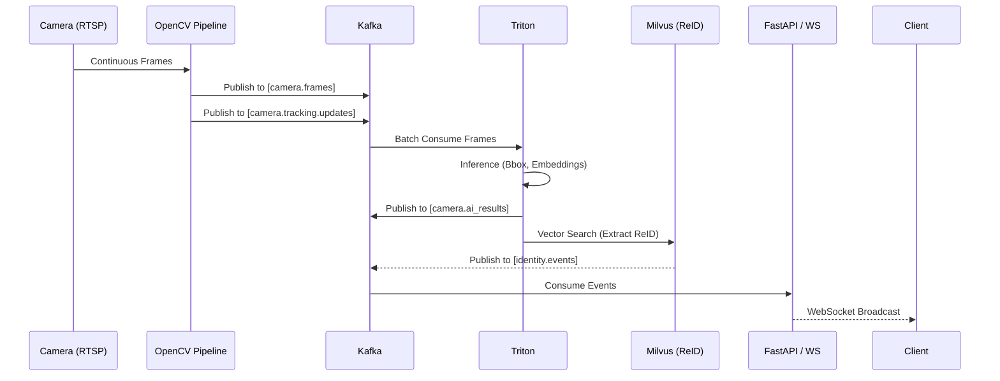

# Real-Time Multi-Camera AI Pipeline — Backend

A production-grade, distributed AI inference and tracking backend for real-time multi-camera systems. This backend leverages FastAPI, Apache Kafka, Triton Inference Server, and Milvus to ingest video streams, perform real-time tracking and Re-Identification (ReID), and stream structured events to clients.

## 🏗️ System Architecture

### Overall Design
The system employs an event-driven microservices architecture optimized for high-throughput, low-latency video processing.

```mermaid
graph TD
    %% Architecture Diagram
    C1[Camera 1] -->|RTSP| O[OpenCV Pipeline]
    C2[Camera N] -->|RTSP| O
    
    subgraph Data Ingestion & Edge
    O
    end
    
    subgraph Streaming Layer
    O -->|Frames & BBoxes| K[Kafka]
    end
    
    subgraph AI Inference Layer (Triton)
    K -->|Frames| T[Triton Inference Server]
    T -.->|Feature Vectors| K
    end
    
    subgraph Identity & ReID
    T -->|Embeddings| M[(Milvus Vector DB)]
    M -->|ReID Results| I[Identity Service]
    I -->|Tracking Events| P[(PostgreSQL)]
    end
    
    subgraph Control Plane & API
    P --> F[FastAPI Control Plane]
    I --> F
    end
    
    subgraph Presentation
    F -->|REST / WebSockets| U[Web UI / Clients]
    end
```

### Tech Stack
- **API & Control Plane:** FastAPI, WebSockets
- **Event Streaming:** Apache Kafka (managed via Confluent)
- **Model Serving:** NVIDIA Triton Inference Server
- **Vector Database (ReID):** Milvus + MinIO + etcd
- **Metadata & State:** PostgreSQL
- **Edge Processing:** OpenCV-based pipeline
- **Observability:** Prometheus, Grafana, Loki, Grafana Alloy

---

## 📂 Directory Structure

```text
backend/
├── src/
│   ├── api/                  # FastAPI routers and control plane
│   ├── core/                 # App configuration, DB session, logger
│   ├── models/               # SQLAlchemy DB models (cameras, events)
│   ├── observability/        # System & Prometheus metrics integration
│   ├── opencv_pipeline/      # RTSP ingestion, frame decoding, tracking
│   ├── schemas/              # Pydantic schemas for API validation
│   └── services/             # Core business logic (Camera, Inference, ReID)
├── model_repository/         # Triton model artifacts and configuration
├── observability/            # Loki, Alloy, Prometheus, Grafana configs
├── runtime/                  # Persistent data (Milvus, Etcd, Loki)
├── docs/                     # Additional technical documentation
├── docker-compose.yaml       # Production infrastructure orchestration
├── main.py                   # Application entrypoint & edge worker bootstrap
├── pyproject.toml            # Python dependencies (uv/pep 621)
└── requirements.txt          # Exported pinned dependencies
```

---

## 🔄 Data Flow (Lifecycle Diagram)

The pipeline uses an asynchronous, non-blocking flow from ingestion to presentation.

**Camera → Pipeline → Kafka → Triton → ReID → Identity → Output**

1. **Camera (Ingestion):** RTSP streams are read asynchronously.
2. **OpenCV Pipeline:** Performs decoding, basic preprocessing, and byte-tracking.
3. **Kafka (Event Bus):** Raw frames, tracking updates, and bounding boxes are published to topics.
4. **Triton (Inference):** Batch ingests frames from Kafka, passing them through detection/ReID models.
5. **ReID (Milvus):** Triton outputs feature embeddings which are pushed to Milvus for fast vector similarity search.
6. **Identity Management:** Merges current tracking bounds with global identities. Creates, updates, or expires identities.
7. **Output (FastAPI/WebSocket):** Processed metadata and events are broadcasted in real-time.



---

## 🌐 Services Overview

- **FastAPI Control Plane:** Manages camera CRUD, stream state, and API routing.
- **OpenCvPipelineRuntime:** Continuously polls active cameras, extracts frames, and manages a frame buffer.
- **TrackingKafkaProducerService:** Handles high-volume async publishing to Kafka.
- **Inference Runtime Service:** Orchestrates communication between Kafka, Triton, and Milvus.
- **MetricsServer:** Aggregates and exposes prometheus metrics for pipeline throughput.

---

## 📡 API Documentation

### Control APIs
- `GET /health` : System healthcheck and status.
- `GET /cameras` : List registered cameras.
- `POST /cameras` : Register a new camera stream.
- `GET /cameras/{id}` : Get camera configuration.
- `PUT /cameras/{id}` : Update camera settings (e.g., enable/disable).
- `DELETE /cameras/{id}` : Remove a camera.

### Stream APIs
- `GET /stream/status` : Retrieve global stream statuses.
- `PATCH /stream/control` : Start/stop pipeline processing for specific cameras.
- `WS /ws/updates` : Real-time WebSocket feed for combined tracking and identity events.

*(Note: Ensure authorization tokens are sent via headers on restricted routes)*

---

## 📨 Kafka Topics & Schemas

The event bus uses Confluent Kafka. All communications are standard JSON messages.

| Topic Name | Purpose | Producer | Consumer |
|---|---|---|---|
| `camera.frames` | Raw/encoded frame payloads | OpenCV Pipeline | Triton |
| `camera.tracking.updates`| Local BBoxes + Tracker IDs | OpenCV Pipeline | API |
| `camera.ai_results` | Outputs from ML models | Triton | API/ReID layer |
| `identity.events` | Global merged ReID statuses | ReID Layer | API, Database |
| `camera.status` | State toggles (Online/Offline) | API | Pipeline |
| `camera.events` | General system events | API/Pipeline | Database |

**Example Schema (`identity.events`):**
```json
{
  "camera_id": "cam-01",
  "timestamp": 1712234051.491,
  "local_track_id": 14,
  "global_identity_id": "uuid-9f123",
  "confidence": 0.94,
  "bbox": [120, 50, 200, 310]
}
```

---

## 👤 ReID & Identity System

The identity service bridges local temporal tracking with long-term cross-camera identification.

- **Embedding Extraction:** Triton processes cropped person images to generate 512-dimensional feature vectors.
- **Vector Search:** Feature vectors are queried against Milvus using L2/Cosine similarity metrics to find closest matches across history.
- **Identity Lifecycle:**
  - **Create:** If cosine distance falls outside the threshold of known clusters, allocate a new `global_identity_id`.
  - **Update:** If a match is found, append the latest embedding to continuously update the centroid.
  - **Expire:** Identities not seen for configured TTL hours are pruned from active memory or archived to cold storage via PostgreSQL.

---

## 🚀 Setup & Installation

### Prerequisites
- Docker & Docker Compose v2+
- NVIDIA GPU with drivers installed
- NVIDIA Container Toolkit (`nvidia-docker2`)
- Python 3.10+ (for local environment execution)

### Environment Variables
Create a `.env` file based on the production template:
```bash
cp .env.example .env
```
Key configurations include:
```env
MINIO_ROOT_USER=admin
MINIO_ROOT_PASSWORD=securepassword
POSTGRES_USER=postgres
POSTGRES_PASSWORD=postgres
POSTGRES_DB=pipeline_db
METRICS_ENABLED=true
```

### Running the System
Start infrastructure and inference in the correct order to guarantee dependency resolution:

1. **Deploy Data and Event Layers**
   ```bash
   docker compose up -d etcd minio milvus
   docker compose up -d kafka kafka-init
   ```
2. **Deploy Observability layer (Optional but recommended)**
   ```bash
   docker compose up -d prometheus grafana loki alloy
   ```
3. **Deploy Inference Engine**
   ```bash
   docker compose up -d triton
   ```
4. **Start the API & Edge Pipeline**
   ```bash
   uv run python main.py
   ```
   *For pure containerized deployments, the unified service relies on building via a unified Dockerfile.*

---

## 📈 Scaling & Deployment

- **Triton Servers:** Horizontally scalable behind a load balancer (e.g., HAProxy/Nginx). Set `--model-repository` arguments dynamically.
- **Kafka Consumers:** The API and Triton ingestion layers utilize consumer groups. To increase read throughput, scale up consumer instances matching partition count workloads.
- **Edges:** The OpenCV pipeline can be decoupled and deployed directly on physical edge nodes, forwarding encoded frames to a centralized Kafka cluster over WAN.

---

## 📊 Observability

This stack incorporates an enterprise monitoring pattern:

- **Metrics (Prometheus & Grafana):**
  - Pipeline FPS (Frames Per Second), DB latencies, and dropped frames are exported via Python metric endpoints (controlled via `SystemMetricsCollector`).
  - Triton natively exports GPU usage, queue saturation, and inference times on port `:8002`.
  - Kafka JMX metrics are collected via Prom-Exporter.
- **Logging (Loki + Alloy):**
  - All Python services leverage structlog to write logs to stdout using structured JSON formatting.
  - Grafana Alloy scrapes container logs and ships them reliably to Loki for trace analysis.
- **Debugging Tips:**
  - If ReID is failing suddenly, view Milvus health: `curl http://localhost:9091/healthz`.
  - If Kafka lags, monitor consumer group lag directly: `kafka-consumer-groups --bootstrap-server kafka:9092 --describe --group triton-ingest`.

---

## 🔒 Security Considerations

- **RTSP Credential Handling:** Never hardcode credentials. Ensure the API safely retrieves them from the DB or a vault before passing URIs to OpenCV.
- **API Security:** Endpoints must sit behind an API Gateway (e.g., Kong, Traefik, or an Ingress controller) providing TLS termination and JWT validation.
- **CORS Configuration:** Limit wildcard CORS defaults via FastAPI middleware explicitly prior to deployment.
- **Network Boundaries:** Internal services DO NOT expose `19530` (Milvus) or `2379` (etcd) to the public web. All data plane transactions must remain within the isolated `backend_net` Docker network.

---

## 🛠️ Troubleshooting

- **Memory Leak in Pipeline:** Validate that the frame buffer in `src/opencv_pipeline/runtime.py` is size-bounded to avoid OOM crashes under fluctuating RTSP throughput.
- **Kafka Init Fails:** Verify local KRaft/Zookeeper volumes aren't corrupt. Restart the `kafka-init` container once `kafka` becomes healthy.
- **Triton Model Not Loading:** Ensure path mounts inside `docker-compose.yaml` exactly mirror your host's `./model_repository` strict layout convention.

---

## 💡 Future Improvements

- **Schema Registry Integration:** Adopt Protobuf or Avro with Confluent Schema Registry for strict Kafka payload versioning.
- **CI/CD Triggers:** Establish test evaluations against gold-standard offline video segments prior to Triton deployments.
- **WebRTC Upgrade:** Transition WebSocket stream outputs to WebRTC for frame-perfect, sub-second latency rendering in the presentation layer.
