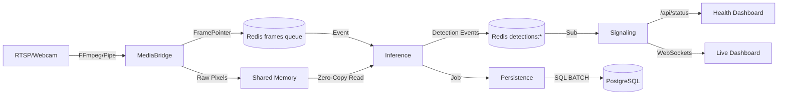

# Backend Architecture & System Design

This document provides a deep technical dive into the **Pipeline OpenCV** architecture, focusing on performance, scalability, and real-time reliability.

---

## 1. System Topology & Data Flow

The system is designed as a **decoupled microservices pipeline**. Individual services communicate via high-bandwidth **Shared Memory (SHM)** for pixel data and low-latency **Redis Pub/Sub/Streams** for metadata and events.

### High-Level Data Flow

---

## 2. Core Infrastructure Components

### A. Zero-Copy Shared Memory (shared.shm)
To avoid the overhead of serializing multi-megabyte images (720p/1080p) across processes, we use **Ring Buffers** in shared memory.

1.  **Memory Allocation**: `MediaBridge` allocates a large block of shared memory (approx 100MB per camera) using `multiprocessing.shared_memory`.
2.  **Ring Index**: A separate 8-byte atomic counter keeps track of the current write slot.
3.  **ReaderCache**: The `Inference` service maintains persistent attachments to these SHM segments, preventing frequent attachment hits.

### B. Media Ingestion (FFmpeg Source)
For production-grade RTSP reliability, we use a piped **FFmpeg process** instead of basic OpenCV capture:
-   **Stability**: FFmpeg handles network jitter and connection drops with high resilience.
-   **Performance**: Uses hardware acceleration (CUDA/auto) and TCP transport for lossless packet delivery.
-   **Supervisor**: A health monitor automatically restarts crashed camera worker processes within 5 seconds.

### C. GPU Model Management (ModelManager)
To optimize VRAM consumption, we use a **Singleton ModelManager**:
-   **Lazy Loading**: Models (YOLO 2.6, X3D) are only loaded when the first frame arrives, saving memory on idle.
-   **CUDA Warm-up**: Runs dummy inference to initialize kernels, eliminating the "first-frame lag".
-   **Shared Context**: All inference tasks share the same GPU handle for better memory fragmentation management.

---

## 3. Inference Pipeline (D1–D5)

A high-performance pipeline using YOLO 2.6, ByteTrack, EfficientNetB0-Transformer, and Redis.

1.  **D1: Detection (YOLO 2.6)**: extracts person bounding boxes and masks.
2.  **D2: Privacy/Blur**: Vectorized NumPy operations blend target players with blurred backgrounds.
3.  **D3: Tracking (ByteTrack)**: Maintains identity consistency using IOU/Kalman matching.
4.  **D4: Interaction Logic**: Spatial state machine for proximity detection.
5.  **D5: Behavior Classification (X3D/EfficientNet)**: 
    -   **Non-Blocking**: Classifications run as asynchronous tasks to avoid blocking the live stream.
    -   **Temporal Buffer**: A rolling window of processed frames is buffered for action recognition.

---

## 4. Health & Monitoring

### Standard Status API
The `Signaling` service exposes a comprehensive health check at `/api/status`:
-   **GPU Analytics**: Real-time VRAM (used/free) and GPU utilization.
-   **Camera Health**: Counter of total vs. active streaming cameras.
-   **Infrastructure**: Redis connectivity status and system CPU/RAM usage.

### Queue Draining (Lag Recovery)
If the system lags (e.g., due to background classification spikes), the `Inference` service monitors the `frames` queue length. If backlog exceeds **100 frames**, it automatically drains the queue to return to real-time parity.

---

## 5. Deployment Guidelines

### Hardware Requirements
-   **GPU**: NVIDIA (Desktop RTX 3060+ or Jetson Orin) for FP16 inference.
-   **Memory**: Min 8GB RAM (2GB+ dedicated to SHM).

### Operational Maintenance
-   **Logging**: Services use `structlog` for JSON-formatted logs suitable for ELK/Grafana.
-   **Verification**: Final system audit via `python .agent/scripts/checklist.py .`.
