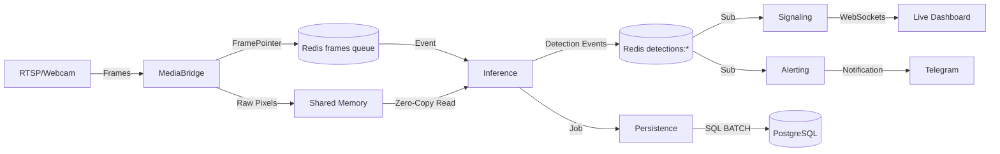

# Backend Architecture & System Design

This document provides a deep technical dive into the **Pipeline OpenCV** architecture, focusing on performance, scalability, and real-time reliability.

---

## 1. System Topology & Data Flow

The system is designed as a **decoupled microservices pipeline**. Individual services communicate via high-bandwidth **Shared Memory (SHM)** for pixel data and low-latency **Redis Pub/Sub/Streams** for metadata and events.

### High-Level Data Flow

---

## 2. Core Infrastructure Components

### A. Zero-Copy Shared Memory (libs.shared.shm)
To avoid the overhead of serializing multi-megabyte images (720p/1080p) across processes, we use **Ring Buffers** in shared memory.

1.  **Memory Allocation**: `MediaBridge` allocates a large block of shared memory (approx 100MB per camera) using `multiprocessing.shared_memory`.
2.  **Ring Index**: A separate 8-byte atomic counter (using `ctypes` and SHM) keeps track of the current write slot.
3.  **FramePointer**: Only a lightweight reference (Camera ID + Slot ID + Timestamp) is sent over Redis.
4.  **ReaderCache**: The `Inference` service uses a `ReaderCache` to maintain persistent attachments to these SHM segments, preventing the performance hit of frequent attachment/detachment.

### B. Redis Topology
Redis acts as the central nervous system for the pipeline:

-   **`frames` (List/Queue)**: A high-priority queue for `FramePointer` messages.
-   **`detections:{cam_id}` (Pub/Sub)**: Real-time broadcast of JSON detections.
-   **`config:{cam_id}` (Hash)**: Storage for live configurations (ROI, thresholds).
-   **`persistence_queue` (List)**: Reliable queue for events that must be saved to the database.

---

## 3. Inference Pipeline (D1–D5)

The `inference` service executes a staged pipeline on every frame:

1.  **D1: Detection/Segmentation (YOLOv8)**: Extracts person bounding boxes and high-res polygon masks.
2.  **D2: Privacy/Background Blur**: Vectorized NumPy operations blend a target person with a blurred background using the inverse segment mask.
3.  **D3: Tracking (IOU Tracker)**: Maintains identity consistency across frames using Intersection-over-Union matching.
4.  **D4: Interaction Logic**: A spatial state machine checks if a tracked person is in proximity to items or specific ROIs.
5.  **D5: Behavior Classification (EfficientX3D)**: 
    -   **Non-Blocking**: Highly expensive (7s+) classifications run in background `asyncio` tasks.
    -   **Temporal Buffer**: A rolling window of processed frames is maintained in memory for video classification.

---

## 4. Real-Time Stability Measures

### Queue Draining (Lag Recovery)
In a real-time system, "stale" data is worse than "no" data. If the system lags (e.g., due to a temporary GPU spike):
-   The `Inference` service monitors the length of the `frames` queue.
-   If the backlog exceeds **100 frames**, the service automatically **drains the queue**, keeping only the single newest frame.
-   This "jumps" the system back into real-time parity immediately.

### Memory Integrity
-   **Leaked SHM Prevention**: Scripts like `run_local.sh` and service clean-up handlers (SIGTERM) ensure that `/dev/shm` handles are unlinked to prevent system memory exhaustion.

---

## 5. Deployment Guidelines

### Hardware Requirements
-   **GPU**: NVIDIA Jetson (Orin/Xavier) or Desktop GPU (RTX 3060+) for FP16 TensorRT inference.
-   **Memory**: At least 8GB RAM (approx 2GB allocated for SHM).

### Operational Maintenance
-   **Logging**: All services use `structlog` for JSON-formatted logs.
-   **Monitoring**: Check `scripts/inspect_data.py` for a live health dashboard of the Redis queues and MQTT latency.
